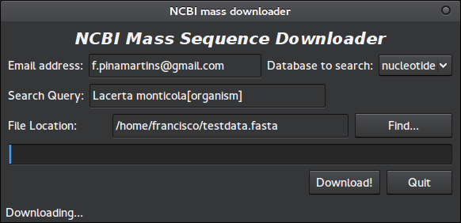

# NCBI Mass Sequence Downloader

## Description:
This program will download sequences *en masse* from several NCBI databases (at the user's chioce).
After the downloading is finished, the program will check the resulting file for any missing sequences and continuously retry the download until all sequences are present in the local file.
It will run on both python2 and python3.

## Installation:
Not required. Just clone the repository or uncompress one of the releases and run from there.

## Usage:
To use the GUI version:

    python NCBI_downloader.py

To use the command line version:

    python NCBI_downloader.py "user@email-address.com" "Query term" "database" outfile.fasta

Notes:
* The program will not overwrite anything in the output file, but rather append sequences to it;
    * If you do not want this behavior, please use an empty file as output.
* You may use *NCBI Mass Seqence Downloader* to access any of these databases: "nucleotide", "nuccore", "nucgss", "nucest", "protein", "genome" and "popset".
* *Query term* can take any argument just like in the website search engine (eg. "Lacerta monticola[organism]");
* The program uses the Entrez module from [biopython](https://github.com/biopython/biopython). It was ported to python 3, and this is slightly different from the original it was forked from. A big Kudos to the authors.

## Testing:
In order to test the program run the following:

     python NCBI_downloader.py "your.address@email-provider.com" "Lacerta monticola[organism]" "nucleotide" testdata.fasta

Replacing "your.address@email-provider.com" with your email address. If everything is working as it should, you should receive a fasta file with 182 sequences. However, please note that due to the changing nature of the database, this value is likely to change over time.

You may alternatively enter the same data on the GUI, and the expected result should be the same:

## Dependencies:
* Pyhton (2 or 3) (and the standard lib);
* [PyQt5](http://www.riverbankcomputing.com/software/pyqt/intro) for the GUI version.

## Future plans:
* For now the *FASTA* format is hard-coded in the program, but this may change should there be demand for it;
    * This effectively limits *NCBI Mass Sequence Downloader* to **sequence** databases.
* As more NCBI sequence databases become available, they will be added to *NCBI Mass Sequence Downloader*.
* Add more online help topics, as suggested in issue #1.

## License:
GPLv3

## Known limitations:
* There is **NO** argument checking of any kind. If there is a problem with your arguments, you will see no *hand holding* of any kind, just plain python error messages.

## Found a bug?
Or would like a feature added? Or maybe drop some feedback?
Just open an issue on github.
