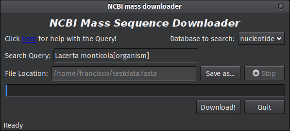

# Testing
In order to test the program run the following:

     python NCBI_downloader.py "your.address@email-provider.com" "Lacerta monticola[organism]" "nucleotide" testdata.fasta

Replacing "your.address@email-provider.com" with your email address. If everything is working as it should, you should receive a fasta file with 182 sequences. However, please note that due to the changing nature of the database, this value is likely to change over time.

You may alternatively enter the same data on the GUI, and the expected result should be the same:

[Return to Introduction](index.md)
